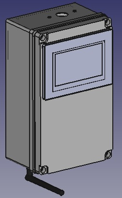
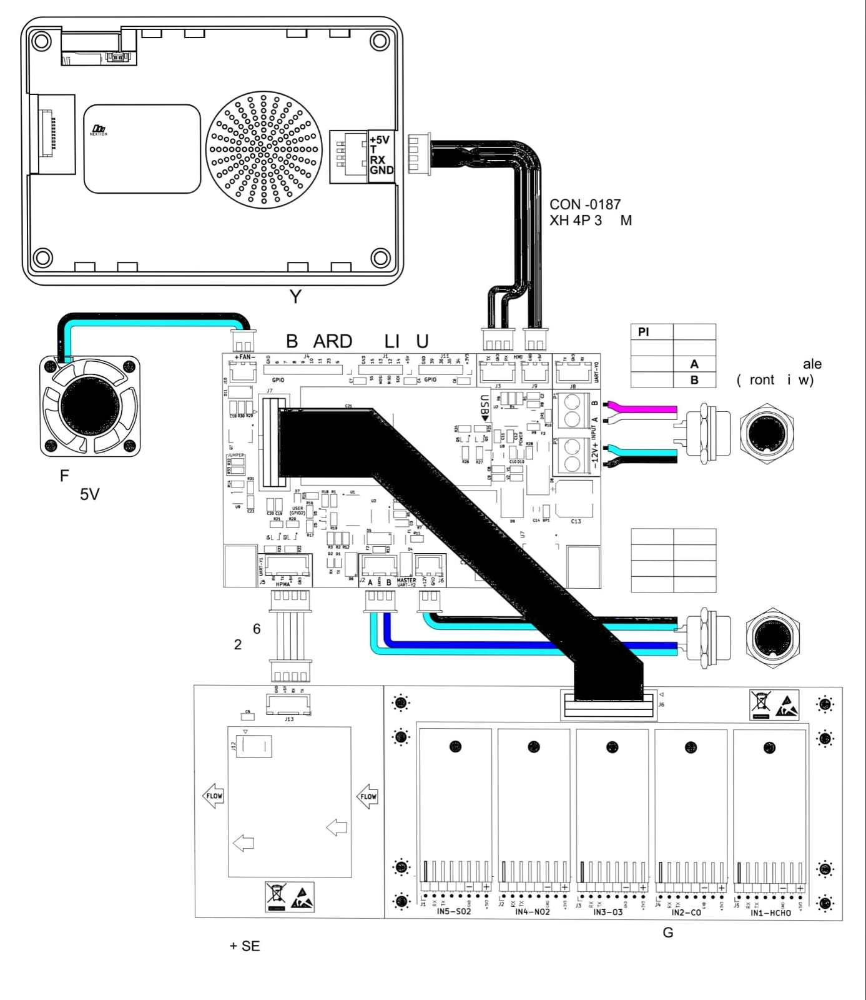

# Monita AQMS

Module Aqms _sub module Monita_ yang dbersisi sensor sensor AQMS sebagai interface sensor ke module data aqusisi Monita

Memiliki beberapa gabungan sensor
- PM2.5 / PM10
- SO2, NO2, CO, O3, HC

Terdapat main procesor dan tampilan untuk menampilkan Nilai data 

